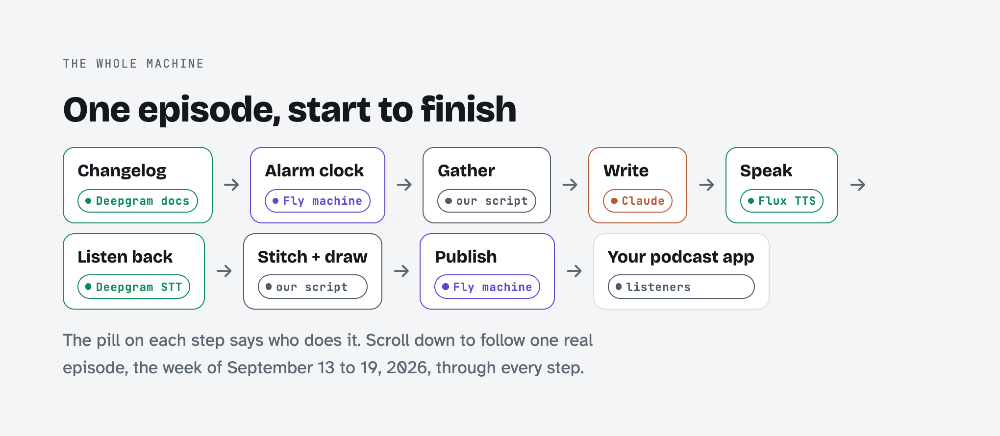
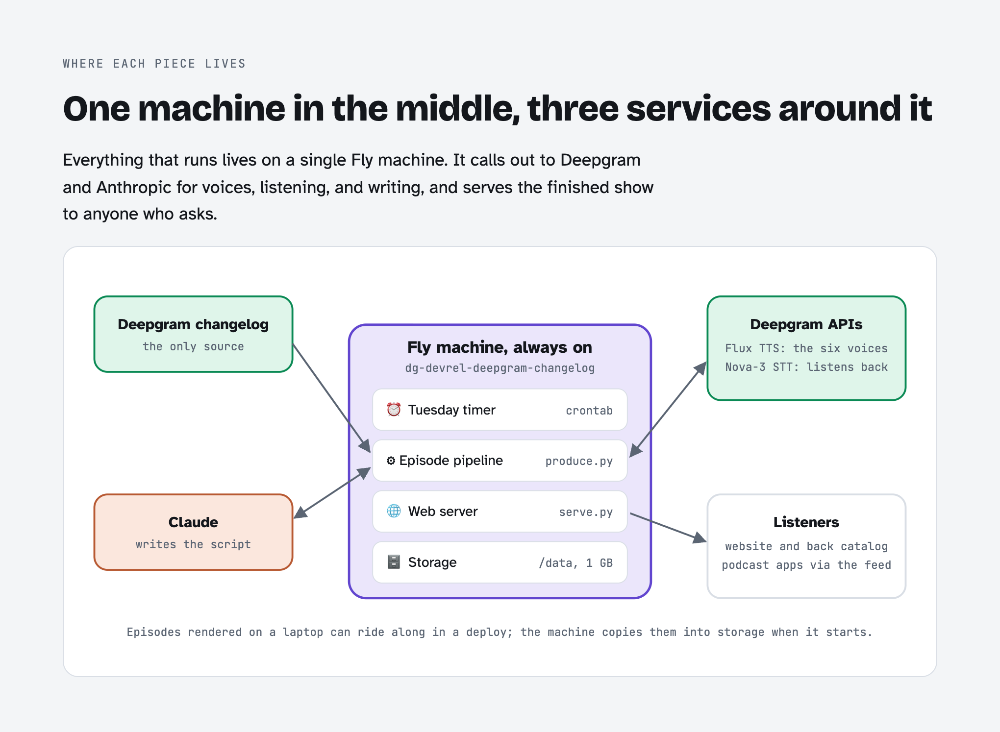

# The Deepgram Changelog

Deepgram ships something almost every week, and almost nobody reads the changelog. So this reads
it to you. Every Tuesday at 5am Pacific, a Fly machine pulls last week's entries, Claude writes the
script, six Deepgram Flux TTS voices perform it, and Deepgram speech-to-text checks every line
before it ships. Nobody records anything (the closest thing to a studio is a Python script).

There are 140 episodes so far, going back to 2020. They run one to five minutes, and a typical
week comes in around two.

Listen: [dg-devrel-deepgram-changelog.fly.dev](https://dg-devrel-deepgram-changelog.fly.dev) ·
[podcast feed](https://dg-devrel-deepgram-changelog.fly.dev/episodes/feed.xml) ·
[back catalog](https://dg-devrel-deepgram-changelog.fly.dev/back-catalog)

This repo is the code, not the archive. A clone has no audio at all: MP3s are gitignored, and the
only episode in `episodes/` is `2026-09-22`, kept as a worked example (its script, show notes,
chapters, transcript, and readback report, but no MP3). All 140 episodes live on the site's volume
and play from the links above.

## From Changelog To Your Queue

```mermaid
flowchart LR
  CL["Deepgram changelog<br/>one Sunday to Saturday week"] --> CRON["Tuesday 5am Pacific<br/>crontab, weekly_run.py"]
  CRON --> GATHER["Gather the week<br/>backfill_plan.py"]
  GATHER --> WRITE["Write the script<br/>Claude, write_episode.py"]
  WRITE --> SPEAK["Speak each paragraph<br/>Flux TTS, render_episode.py"]
  SPEAK --> CHECK["Listen back, retake<br/>Deepgram STT, readback_check.py"]
  CHECK --> STITCH["Stitch MP3, chapters,<br/>transcript, art"]
  STITCH --> PUB["Publish feed, site,<br/>back catalog"]
  PUB --> APPS["Podcast apps"]
```

<picture>
  <source media="(prefers-color-scheme: dark)" srcset="docs/images/pipeline-dark.png">
  
</picture>



| Step | What happens | Where |
| --- | --- | --- |
| Gather | Reads the changelog's RSS feed and keeps one Sunday to Saturday week. Those entries are the only facts an episode may use. | `scripts/changelog_source.py`, `scripts/backfill_plan.py` |
| Write | Claude writes the summary, the segments, and the show notes. The intro, outro, cost, and contact lines are fixed text. The output is checked for known segments in order and for links that exist in the changelog. | `scripts/write_episode.py`, `docs/show-format.md` |
| Cast | Brooke anchors; Drew, Kit, Miles, Cole, and Elise each own a segment and hand off by name. Every voice runs at expressivity 1. | `docs/cast.json` |
| Speak | One Flux TTS call per paragraph, cached by voice and text. A few words get a spoken spelling first ("change log"). | `scripts/render_episode.py` |
| Listen back | Deepgram STT transcribes each clip and diffs it against the script; a mismatch is re-rendered up to three times and the best take kept. | `scripts/readback_check.py` |
| Stitch and draw | Clips join into a 64 kbps MP3 with chapters and a VTT transcript; the episode art is drawn from the segments that aired. | `scripts/render_episode.py`, `scripts/make_art.py` |
| Publish | The feed, index, and back catalog rebuild on the machine's volume, which the web server reads directly. | `scripts/build_feed.py`, `scripts/build_catalog.py`, `scripts/serve.py` |
| Run log | Every Tuesday run leaves a bundle in `/data/runs/`, and also sweeps the four prior weeks for late entries. | `scripts/weekly_run.py`, `scripts/produce.py` |

The picture-first guide, with audio clips, is [`docs/how-it-works.html`](docs/how-it-works.html).
It's the canonical copy; open it locally, since GitHub shows HTML as source. Images for posts live in
[`docs/images/`](docs/images/).

<picture>
  <source media="(prefers-color-scheme: dark)" srcset="docs/images/architecture-map-dark.png">
  
</picture>

## Run It On Your Own Machine

You'll need Python 3.9 or newer, ffmpeg, and two packages: `anthropic` (the writer) and `pillow` (the art).
Keys go in a gitignored `.env` (only the render and write steps use them):

```
DEEPGRAM_API_KEY=...
ANTHROPIC_API_KEY=...
```

```bash
set -a; . ./.env; set +a

# One episode end to end, by its Tuesday release date: write, cost, render, readback, art.
python3 scripts/produce.py 2026-09-22

# What the Tuesday job would produce right now, without producing it.
python3 scripts/produce.py --weekly --dry-run

# Serve the site at http://localhost:8010
python3 scripts/serve.py
```

On a fresh clone, `serve.py` works with no keys and no renders. The home page lists nothing yet,
because the feed and episode list only count episodes that have an MP3, but
[localhost:8010/e/2026-09-22](http://localhost:8010/e/2026-09-22) shows the example episode's page,
show notes, and transcript. Render it (`produce.py 2026-09-22`) and the player gets something to play.

The site's look comes from [HN Radio](https://github.com/samgutentag-deepgram/hn-radio). I copied
`web/brand.css`, `theme.js`, `orb.js`, `format.js`, and the icons verbatim from its `web/` so they
can be re-synced. Anything specific to
this show goes in `web/readback.css`.

## Tuesday, 5am, Nobody Awake

Live at [dg-devrel-deepgram-changelog.fly.dev](https://dg-devrel-deepgram-changelog.fly.dev), in the
`deepgram` Fly org. Back catalog, with per-episode cost:
[/back-catalog](https://dg-devrel-deepgram-changelog.fly.dev/back-catalog).

At 5am Pacific every Tuesday, the machine's own cron (supercronic, reading `crontab`) runs
`scripts/weekly_run.py`. That wraps `scripts/produce.py --weekly`, which refreshes the changelog and
writes, renders, checks, and illustrates the episode for the Sunday to Saturday that just ended.
It then rebuilds the feed and the back catalog on the volume, so there's nothing to deploy.
If the run fails, it tries again up to three times, five minutes apart. Set
`CHANGELOG_PUSHOVER_TOKEN` and `CHANGELOG_PUSHOVER_USER` (see `.env.sample`) to get a push for
each retry and for the result (`scripts/alerts.py`).

If a week had no changelog entries, there's no episode that week. Each run also re-checks the four
weeks before it, so an entry that shows up late still gets an episode.

Every run leaves its own record on the volume at `/data/runs/<UTC stamp>/`: a timestamped
`run.log`, the catalog before and after, the feed after, the new episode's `produce.json`, and a
`summary.json` with the exit code. None of it needs a laptop to be awake. To list and pull them:
`fly ssh console -a dg-devrel-deepgram-changelog -C "ls /data/runs"` and
`fly ssh sftp get -a dg-devrel-deepgram-changelog /data/runs/<stamp>/run.log .`.

By hand, locally:

```bash
python3 scripts/produce.py 2026-09-15                 # one episode, by Tuesday release date
python3 scripts/produce.py --backfill 2026 --jobs 3   # every missing week released in 2026
python3 scripts/backfill_plan.py --refresh             # the plan stage_site.py ships with the image
python3 scripts/stage_site.py && fly deploy --remote-only --ha=false
```

Episodes you render locally ship inside the image as `seed/episodes`, and the machine copies them
onto the volume when it boots (`seed_volume.py`). A local re-render replaces the volume copy.
Episodes the cron made only exist on the volume. The machine reads `DEEPGRAM_API_KEY` and
`ANTHROPIC_API_KEY` from Fly secrets. Locally, set `ART_PYTHON` if your default Python doesn't have
Pillow.

**Storage:** an episode takes about 1.5 MB on the volume (a 64 kbps MP3 plus art and JSON). All 140
use about 175 MB of the 1 GB volume, and new weeks add roughly 75 MB a year. The server deletes its
raw paragraph audio (`.cache/tts`) after each run. Locally it's kept, so editing a script only
re-renders the paragraphs you changed.

Each `script.md` carries writer's notes, so the deploy leaves it out. `serve.py` only serves an allowlist of
public file names from the episodes directory.

## Fork It For Your Own Changelog

Nothing in the pipeline is specific to Deepgram's changelog except the URLs, the names, the
segments, and the outro. If your
product has a changelog that nobody reads either, here's the swap.

1. **Get the pieces.** Python 3.9 or newer, ffmpeg, a Deepgram API key (Flux TTS and STT), an
   Anthropic API key (the writer), and your changelog's RSS or Atom feed with the full post in each
   item. See [Where The Entries Come From](#where-the-entries-come-from) below.
2. **Point it at your changelog.** Set `CHANGELOG_FEED_URL` to your feed. Relative links in your
   entries resolve against each entry's own URL, so there's no docs origin to configure. The
   [bare-bones guide](docs/bare-bones.html) is the shortest path to a first episode.
3. **Point it at your site.** Set `SITE_URL` (the default in `scripts/produce.py`, and `[env]` in
   `fly.toml`), then rename `app` in `fly.toml`. `serve.py` reads `SITE_URL` from the environment.
4. **Rename the show.** "The Deepgram Changelog" lives in `TITLE`, `DESCRIPTION`, `AUTHOR`, and
   `OWNER_EMAIL` in `scripts/build_feed.py`, `SITE_TITLE` in `scripts/serve.py`, the MP3 title
   in `scripts/render_episode.py`, the `SYSTEM` prompt and the script template in
   `scripts/write_episode.py`, the drawn title in `scripts/make_art.py`, the page text in
   `web/*.html` and `web/episode.js`, and `docs/show-format.md`. Then rewrite the canned outro (`OUTRO_COST`,
   `OUTRO_PROMO`, `OUTRO_HELP`, and `PROMO_START`/`PROMO_END`) in `scripts/write_episode.py` so it
   points at your own support channels. If your product lines aren't Voice Agent, STT, and TTS,
   the segment list is `SEGMENTS` in `backfill_plan.py`, `write_episode.py`, and `build_catalog.py`,
   plus `RUNNING_ORDER` in `make_art.py`. The keyword regexes that sort entries into segments sit
   at the top of `backfill_plan.py`, and `docs/cast.json` keys voices by segment name.
5. **Recast it.** Edit `docs/cast.json` (the anchor and one voice per segment), put your own
   product's hard words in `docs/key-terms.json`, and run
   `python3 scripts/term_test.py --voice <voice>` once per voice. Pronunciation varies by voice,
   so one pass for the anchor doesn't cover the desk.
6. **Render one week by hand.** Run `python3 scripts/produce.py <a Tuesday>`, then listen to it.
   `produce.py` already runs `readback_check.py` with retakes, so read `episodes/<id>/readback.json`
   for the flags and listen at those spots.
7. **Turn on Tuesdays, then deploy.** `crontab` runs `weekly_run.py` at 5am Pacific; change
   `CRON_TZ` if Pacific isn't your morning. Set the two keys with `fly secrets set`, run
   `backfill_plan.py`, then `stage_site.py` and `fly deploy`.

What it costs, going by the 140 episodes on the live
[back catalog](https://dg-devrel-deepgram-changelog.fly.dev/back-catalog): about 10 cents of Flux
TTS and 9 cents of Claude per episode, so roughly 19 cents a week, or about $10 for a year of
Tuesdays. A backfill costs the same per episode, so check the week count in
`research/backfill-review.html` before you run `--backfill`.

### Plan Your Show With Claude

Not sure what to call it or how to split the segments? Clone the repo, open it in
[Claude Code](https://claude.com/claude-code), and paste this with your two links filled in. It
reads your changelog for free (no API keys needed) and proposes a show before it touches anything.

```text
I want to turn my product's changelog into a weekly podcast with this repo.

Product: <your product name>
Changelog page: <https://your-site/changelog>
RSS or Atom feed: <https://your-site/changelog.rss>

1. Set CHANGELOG_FEED_URL to the feed and run `python3 scripts/backfill_plan.py`. Tell me how
   many weeks and entries it found, and whether the items carry full posts or only teasers.
2. Read the entry titles in research/backfill-plan.json and tell me what this changelog is
   mostly about.
3. Suggest 5 show names, each with a one-line pitch. Nothing that sounds like the product's
   official podcast.
4. Propose 3 to 6 segments in running order. Keep "Breaking changes and action required",
   "Launches", and "Quick hits" first, and name the rest after this product's areas. For each
   one, list three real entries from the last year that would have landed in it.
5. Propose a cast from the Flux TTS voices in docs/cast.json and
   https://developers.deepgram.com/docs/flux-tts/overview: one anchor and a voice per segment.
6. Draft a canned intro line and outro for my product, in the style of the ones in
   scripts/write_episode.py, with my own support links in place of Deepgram's.
7. List the exact edits that would make all of it real, file by file.

Don't edit any files or make any paid API calls until I've picked a name and segments.
```

### Where The Entries Come From

All the show needs is your changelog's RSS or Atom feed. Every entry needs a date and its full
post, not a teaser. `scripts/changelog_source.py` reads it and hands the rest of the pipeline one
markdown body per day, where each `## ` heading is one entry. The picture version is
[`docs/changelog-sources.html`](docs/changelog-sources.html).

- **The feed (what the show reads).** Set `CHANGELOG_FEED_URL`. With nothing set, it reads
  Deepgram's. The HTML in each item is converted to markdown, so headings, lists, links, and code
  make it through and styling doesn't. Items on the same day merge, and an item with no heading of
  its own gets its title as one (unless the title is just a date).
- **Bonus: an `llms.txt` index.** If your changelog also publishes one, you can set
  `CHANGELOG_INDEX_URL` instead. It skips the HTML conversion, so the writer reads the entries as
  they were written, but it adds no entries. Check it against the feed first: run
  `python3 scripts/backfill_plan.py` once with each and compare the entry counts in
  `research/backfill-review.html`. Deepgram's doesn't match. On a day with two entries, the
  `.md` page behind its `llms.txt` carries only the first, so the feed has 231 entries to the
  index's 219 across the same 212 days.

## Did It Say That Right?

- `scripts/readback_check.py episodes/<id>` transcribes every rendered paragraph with Deepgram STT
  and diffs it against the script. A flag means "listen here", not "this is wrong".
- `scripts/term_test.py` scores spelling candidates for hard terms over several renders. Terms live
  in `docs/key-terms.json`.

## Known Gaps

- **The readback check can't hear everything.** Speech-to-text leans toward real words, so a near
  miss can transcribe clean. It once heard "minting" fine when a person heard it wrong. It tells you
  where to listen, and a person still does the listening.
- **Launches come from the changelog alone.** If something ships without a changelog entry, the
  show won't mention it. The fix for that belongs in the changelog.
- **Expressivity is a beta Flux TTS setting.** Every voice runs at 1. Give it a listen after a Flux
  model update.
