# The Deepgram Changelog

Deepgram ships something almost every week, and almost nobody reads the changelog. So I built a
show that reads it to you, and the same code turns any RSS feed into a podcast. Every Tuesday at 5am Pacific, a Fly machine pulls last week's entries,
Claude writes the script, six Deepgram Flux TTS voices perform it, and Deepgram speech-to-text
checks every line before it ships. Nobody records anything.

There are 141 episodes so far, going back to 2020. They run one to six minutes, and a typical week
comes in around two.

Listen: [dg-devrel-deepgram-changelog.fly.dev](https://dg-devrel-deepgram-changelog.fly.dev) ·
[podcast feed](https://dg-devrel-deepgram-changelog.fly.dev/episodes/feed.xml) ·
[back catalog](https://dg-devrel-deepgram-changelog.fly.dev/back-catalog) ·
[build your own](https://dg-devrel-deepgram-changelog.fly.dev/build)

This repo is the code, not the archive. MP3s are gitignored, so a clone has no audio. The one
episode in `episodes/` is `2026-09-22`, kept as a worked example with its script, show notes,
chapters, transcript, and readback report. All 141 episodes live on the site and play from the
links above.

## Make One From Any RSS Feed

Point this at an RSS or Atom feed and you get a multi-voice podcast of it. It's built around
changelogs, and a changelog fits the segments out of the box, but any feed that carries full posts
works. A blog or news feed will want its own segments (see [What Else To Change](#what-else-to-change)).

You can have your own show running on your laptop in under half an hour. Deepgram's show averages
about 20 cents an episode, all in. A busy stretch of a bigger changelog costs more: a test on Claude
Code's changelog came to 95 cents for a 10-minute episode.

### The Fast Way

Clone the repo, open it in [Claude Code](https://claude.com/claude-code), and run `/start`:

```bash
git clone https://github.com/samgutentag-deepgram/deepgram-changelog-podcast.git
cd deepgram-changelog-podcast
claude
```

```text
/start https://tailscale.com/changelog/index.xml
```

Use your own feed's URL, or leave it off and `/start` will suggest a few. It checks your setup
and offers to install what's missing, tells you where to put your API keys (never in the chat),
plans the show from the feed, fills in `show.json` with you one question at a time, renders the
first episode after you say go, opens the site, and asks how many more to make. The steps below are
the same flow by hand, and `CLAUDE.md` tells Claude Code how to work in this repo.


- **git, Python 3.9 or newer, and ffmpeg.** On a brand new Mac, run `xcode-select --install` (it
  brings git and Python 3.9), then install [Homebrew](https://brew.sh) and `brew install ffmpeg`.
- **A Deepgram API key** for the voices and the listen-back check:
  [console.deepgram.com/signup](https://console.deepgram.com/signup). New accounts start with $200
  in credit.
- **An Anthropic API key** for the writer: [console.anthropic.com](https://console.anthropic.com).
- **[Claude Code](https://claude.com/claude-code)** for step 4. It's optional; you can fill in
  `show.json` by hand instead.

### Steps By Hand

If you're an agent following these for someone, steps 4, 5, and 7 ask questions only your user can
answer (the show's name, the cadence, how many episodes to pay for). Ask them.

1. **Clone the repo.**

   ```bash
   git clone https://github.com/samgutentag-deepgram/deepgram-changelog-podcast.git
   cd deepgram-changelog-podcast
   ```

2. **Install the two Python packages in a virtual environment.** A venv works the same on macOS's
   built-in Python and on Homebrew's, and keeps the packages out of your system's.

   ```bash
   python3 -m venv .venv
   source .venv/bin/activate    # run this again in every new terminal
   pip install anthropic pillow
   ```

3. **Add your keys.** Copy the sample, then put both keys in `.env` (it's gitignored).

   ```bash
   cp .env.sample .env
   ```

   ```
   DEEPGRAM_API_KEY=...
   ANTHROPIC_API_KEY=...
   ```

4. **Plan your show with Claude Code.** Run `claude` in the repo, then:

   ```text
   /plan-show https://tailscale.com/changelog/index.xml
   ```

   Use your own feed's URL. It reads the feed for free, recommends a cadence, and proposes show
   names, segments, a cast, and an intro and outro, without editing anything. When you pick a name,
   it fills in `show.json` (the name, the two lines drawn on the art, the description, and the
   links) and tells you to run the quickstart. The quickstart asks questions as it goes, so run it
   in a second terminal tab, not from inside Claude Code. You can leave Claude Code open.

   It asks for each `show.json` field one at a time. `author` and `owner_email` only go in the
   podcast feed: apps show the author as "by ..." under the name, and Apple Podcasts and Spotify
   send their verification email to the owner address, which anyone reading the feed can see. For
   a show about someone else's product, put yourself (or your team) as the author, not the
   product. For a local test, any email works.

   The command is a prompt in [`.claude/commands/plan-show.md`](.claude/commands/plan-show.md).
   Without Claude Code, read it and fill in `show.json` by hand.

5. **Run the quickstart** in a terminal, with the virtual environment active.

   ```bash
   source .venv/bin/activate
   python3 scripts/quickstart.py
   ```

   In order, it:
   - checks your setup (Python, ffmpeg, both packages, both keys) and says what to fix
   - reads your feed, which is free
   - recommends a cadence from the feed's history and asks whether to switch `show.json` to it
     (see [Cadence](#cadence)). Answer `y` to take it.
   - renders the newest episode, which takes 5 to 25 minutes and about 20 cents to a dollar
   - draws the show cover and the episode's art, then opens the site in your browser at
     `localhost:8010` (or the next free port, and it prints the address)
   - prints how long each step took and what it used (Claude tokens, Flux TTS characters, and
     the cost of each), and keeps a copy in `research/timings.json`

6. **Look around.** The episode page has the player, chapters, the script following along, show
   notes, and what that episode cost. **Back catalog** in the header lists every episode your feed
   supports, rendered or not, with an estimate for the rest.
7. **Render more.** Back in the terminal, the quickstart says how many more episodes your feed has
   and what they'd cost, then asks "How many more?" Type a number, `all`, or press Enter to stop.
   The back catalog refreshes every minute, so you can watch them land. Ctrl-C stops the site, and
   `python3 scripts/quickstart.py --more` picks up where you left off.

The first episode still sounds like Deepgram's show in a few places. See
[What Else To Change](#what-else-to-change) for the outro, the segments, and the cast.

### Cadence

`show.json` sets how often an episode comes out and which day it publishes:

- `"cadence"`: `weekly` (Sunday to Saturday), `biweekly` (two Sundays to Saturdays, on a fixed
  grid), or `monthly` (the calendar month).
- `"release_day"`: the weekday it publishes, the first one at least two days after its window ends.
  The default, Tuesday, gives a weekly show a Monday buffer for late entries.

An episode's id is its release date, so pick a cadence before you render much. To see what your feed
supports, run `python3 scripts/cadence.py`. It reads the last 26 weeks and picks the fastest cadence
where a typical episode has at least 2,500 characters of changelog (about two minutes of material)
and no more than a fifth of episodes would be empty. Measured on 2026-10-01:

| Feed | Typical week | Recommendation |
| --- | --- | --- |
| Deepgram | 3,300 characters | weekly |
| Resend | 3,700 characters | weekly |
| Cloudflare | 35,000 characters | weekly, with long episodes |
| Linear | 1,500 characters | monthly |
| Tailscale | 1,000 characters | monthly |

### What Else To Change

`/plan-show` and `/start` fill in everything below except the last two items. These are the
places a fork's show gets its own voice:

- **The outro and the writer's brief.** `outro` in `show.json` holds the spoken credit, pitch,
  promo, and support lines and their show-note links, and `writer` says whose changelog it is and
  who it's for. `/plan-show` drafts both from the product's own site. Keep the outro's "rendering it
  cost ..." and "covers more than ... episodes" phrases if you want the real figures filled in.
- **The segments.** `segments` in `show.json` holds the product segments that come after the fixed
  three (Breaking changes and action required, Launches, and Quick hits), each with a back catalog
  label, a spoken name, and a keyword pattern, plus the patterns for launches and quick hits.
  `/plan-show` proposes them from your feed and checks how entries sort. The rules are in
  `scripts/segments.py`, and `python3 scripts/backfill_plan.py` shows the result for free.
- **The cast.** `docs/cast.json` has the anchor and one voice per segment, keyed by segment name.
- **Pronunciation (by hand).** Put your product's hard words in `docs/key-terms.json` and run
  `python3 scripts/term_test.py --voice <voice>` once per voice, since pronunciation varies by
  voice. This makes paid TTS and STT calls.
- **The format spec (by hand).** `docs/show-format.md` is the writer's style guide, and its
  examples name Deepgram's show throughout.

### Credit Line

With `"attribution": true` in `show.json` (the default), every page's header says "read by Deepgram
Flux" under the show name, the footer and the feed description say "Voiced with Deepgram Flux TTS",
and a fork's episode art carries the same line. Both links go to Deepgram's text-to-speech page,
tagged with your site's hostname as `utm_source` and which link it was as `utm_content`, so Deepgram
can see which shows people found it through. Set `"attribution": false` to remove all of it.

## How It Works

```mermaid
flowchart LR
  CL["Changelog feed<br/>one Sunday to Saturday week"] --> CRON["Tuesday 5am Pacific<br/>crontab, weekly_run.py"]
  CRON --> GATHER["Gather the week<br/>backfill_plan.py"]
  GATHER --> WRITE["Write the script<br/>Claude, write_episode.py"]
  WRITE --> SPEAK["Speak each paragraph<br/>Flux TTS, render_episode.py"]
  SPEAK --> CHECK["Listen back, retake<br/>Deepgram STT, readback_check.py"]
  CHECK --> STITCH["Stitch MP3, chapters,<br/>transcript, art"]
  STITCH --> PUB["Publish feed, site,<br/>back catalog"]
  PUB --> APPS["Podcast apps"]
```

<picture>
  <source media="(prefers-color-scheme: dark)" srcset="docs/images/pipeline-dark.png">
  
</picture>



| Step | What happens | Where |
| --- | --- | --- |
| Gather | Reads the changelog's RSS feed and keeps one Sunday to Saturday week. Those entries are the only facts an episode may use. | `scripts/changelog_source.py`, `scripts/backfill_plan.py` |
| Write | Claude writes the summary, the segments, and the show notes. The intro, outro, cost, and contact lines are fixed text. Code checks the output for known segments in order and for links that exist in the changelog. | `scripts/write_episode.py`, `docs/show-format.md` |
| Cast | Brooke anchors, and Drew, Kit, Miles, Cole, and Elise each own a segment and hand off by name. Every voice runs at expressivity 1. | `docs/cast.json` |
| Speak | One Flux TTS call per paragraph, cached by voice and text. A few words get a spoken spelling first ("change log"). | `scripts/render_episode.py` |
| Listen back | Deepgram STT transcribes each clip and diffs it against the script. A mismatch gets re-rendered up to three times, and the best take wins. | `scripts/readback_check.py` |
| Stitch and draw | Clips join into a 64 kbps MP3 with chapters and a VTT transcript. The episode art is drawn from the segments that aired. | `scripts/render_episode.py`, `scripts/make_art.py` |
| Publish | The feed, index, and back catalog rebuild on the machine's volume, which the web server reads directly. | `scripts/build_feed.py`, `scripts/build_catalog.py`, `scripts/serve.py` |
| Run log | Every Tuesday run leaves a bundle in `/data/runs/` and sweeps the four prior weeks for late entries. | `scripts/weekly_run.py`, `scripts/produce.py` |

The picture-first guide, with audio clips, is [`docs/how-it-works.html`](docs/how-it-works.html).
GitHub shows HTML as source, so open it locally. Images for posts live in
[`docs/images/`](docs/images/).

<picture>
  <source media="(prefers-color-scheme: dark)" srcset="docs/images/architecture-map-dark.png">
  
</picture>

## Run It By Hand

The quickstart wraps these. Each one works on its own, so any step can be rerun.

```bash
set -a; . ./.env; set +a    # the scripts below read keys from the environment, once per shell

python3 scripts/produce.py 2026-09-22                    # one episode, by Tuesday release date
python3 scripts/produce.py 2026-09-15 2026-09-08 --jobs 3   # several, three at a time
python3 scripts/produce.py --weekly --dry-run            # what the Tuesday job would make right now
python3 scripts/backfill_plan.py --refresh               # re-read the feed and rebuild the plan
python3 scripts/serve.py                                 # the site at http://localhost:8010
```

Rendering the example episode takes about 6 minutes and about 18 cents of Flux TTS. Its script is
already in the repo, so it makes no Claude call. It rewrites the tracked files in
`episodes/2026-09-22/`, so expect a dirty working tree afterward. A real `--weekly` on a fresh clone
makes the latest week plus up to four earlier ones it sweeps for late entries, so run `--dry-run`
first.

`serve.py` works with no keys and no renders. The home page lists nothing until an episode has an
MP3, but [localhost:8010/e/2026-09-22](http://localhost:8010/e/2026-09-22) shows the example
episode's page, show notes, and transcript.

The site's look comes from [HN Radio](https://github.com/samgutentag-deepgram/hn-radio). I copied
`web/brand.css`, `theme.js`, `orb.js`, `format.js`, and the icons verbatim from its `web/` so they
can be re-synced. Anything specific to this show goes in `web/readback.css`.

## Deploy It

The live show runs on one [Fly](https://fly.io) machine that wakes up every morning, makes an
episode on release dates, and needs no deploy to publish. [`docs/deploy.md`](docs/deploy.md)
covers how that works, the run logs it keeps, and the four steps to deploy your own.

## Where The Entries Come From

All the show needs is your changelog's RSS or Atom feed. Every entry needs a date and its full
post, not a teaser. `scripts/changelog_source.py` reads it and hands the rest of the pipeline one
markdown body per day, where each `## ` heading is one entry. The picture version is
[`docs/changelog-sources.html`](docs/changelog-sources.html).

- **The feed (what the show reads).** `feed_url` in `show.json`, or `CHANGELOG_FEED_URL` to
  override it for one run. The HTML in each item becomes markdown, so headings, lists, links, and
  code make it through and styling doesn't. Items on the same day merge, and an item with no
  heading of its own gets its title as one (unless the title is just a date). Each feed gets its
  own cache under `.cache/changelog/`, so switching feeds never reads the old one.
- **Bonus: an `llms.txt` index.** If your changelog also publishes one, set `CHANGELOG_INDEX_URL`
  instead. It skips the HTML conversion, so the writer reads the entries as they were written, but
  it adds no entries. Check it against the feed first: run `python3 scripts/backfill_plan.py` once
  with each and compare the entry counts in `research/backfill-review.html`. Deepgram's doesn't
  match. On a day with two entries, the `.md` page behind its `llms.txt` carries only the first,
  so the feed has 231 entries to the index's 219 across the same 212 days.

## Did It Say That Right?

- `scripts/readback_check.py episodes/<id>` transcribes every rendered paragraph with Deepgram STT
  and diffs it against the script. A flag means "listen here", not "this is wrong".
- `scripts/term_test.py` scores spelling candidates for hard terms over several renders. Terms live
  in `docs/key-terms.json`.

## Known Gaps

- **The readback check can't hear everything.** Speech-to-text leans toward real words, so a near
  miss can transcribe clean. It once heard "minting" fine when a person heard it wrong. It tells you
  where to listen, and a person still does the listening.
- **Launches come from the changelog alone.** If something ships without a changelog entry, the
  show won't mention it. The fix for that belongs in the changelog.
- **Expressivity is a beta Flux TTS setting.** Every voice runs at 1. Give it a listen after a Flux
  model update.
- **A fork still has Deepgram's format spec and pronunciation list.** `docs/show-format.md` and
  `docs/key-terms.json` describe Deepgram's show and its hard words. The writer follows the
  segments, cast, writer brief, and outro in `show.json` first, but the spec's examples still lean
  Deepgram until you edit it.
