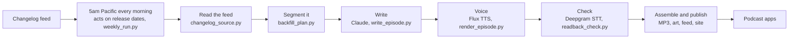

# The Deepgram Changelog

**Turn any RSS feed into a podcast with Deepgram.**

Changelogs are written to be read, and almost nobody reads them. Deepgram ships something almost
every week, so I built a show that reads its changelog to you. Every Tuesday, Claude writes the
script, six Deepgram Flux TTS voices perform it, and Deepgram speech-to-text checks every line
before it ships. Nobody records anything. The same code works on any RSS feed.

There are 141 episodes so far, going back to 2020. They run one to six minutes, and a typical week
comes in around two.

Listen: [dg-devrel-deepgram-changelog.fly.dev](https://dg-devrel-deepgram-changelog.fly.dev) ·
[podcast feed](https://dg-devrel-deepgram-changelog.fly.dev/episodes/feed.xml) ·
[back catalog](https://dg-devrel-deepgram-changelog.fly.dev/back-catalog) ·
[build your own](https://dg-devrel-deepgram-changelog.fly.dev/build)

This repo is the code, not the archive. MP3s are gitignored, so a clone has no audio. The one
episode in `episodes/` is `2026-09-22`, kept as a worked example with its script, show notes,
chapters, transcript, and readback report. All 141 episodes live on the site and play from the
links above.

## What It Costs

Across 141 episodes, Flux TTS averages 10 cents an episode, and about 20 cents all in with Claude
writing the script. All 141 came to $14.57 of Flux TTS for 5.9 hours of audio. New Deepgram
Console accounts start with $200 in free credit.

Flux TTS is $0.045 per 1,000 characters on Pay As You Go, which works out to about 4 cents per
minute of finished audio. A year of weekly episodes runs about $10 all in. Pricing as of
2026-09-25; see [deepgram.com/pricing](https://deepgram.com/pricing).

A busy week on a bigger changelog costs more. The first episode of a show built from Claude Code's
changelog ran almost 16 minutes, took 37 minutes to make, and cost $1.26.

## Build Your Own

The whole show is open source, and the repo comes with a quickstart. It's built around changelogs,
but any RSS or Atom feed with full posts works. A first episode takes 5 to 25 minutes to render and
costs 20 cents to a dollar, more for a busy week. A blog or news feed will want its own segments
(see [What Else To Change](#what-else-to-change)).

### What You Need

- **git, Python 3.9 or newer, and ffmpeg.** On a brand new Mac, run `xcode-select --install` (it
  brings git and Python 3.9), then install [Homebrew](https://brew.sh) and `brew install ffmpeg`.
- **A Deepgram API key** for the voices and the listen-back check:
  [console.deepgram.com/signup](https://console.deepgram.com/signup). New accounts start with $200
  in credit.
- **An Anthropic API key** for the writer: [console.anthropic.com](https://console.anthropic.com).
- **[Claude Code](https://claude.com/claude-code)** for the fast way and step 4 by hand. It's
  optional; you can fill in `show.json` by hand instead.

### The Fast Way

1. **Get two API keys.** Deepgram for the voices and the listen-back check, and Anthropic for the
   writer (see [What You Need](#what-you-need)).
2. **Clone the repo and open it in Claude Code.**

   ```bash
   git clone https://github.com/samgutentag-deepgram/deepgram-changelog-podcast.git
   cd deepgram-changelog-podcast
   claude
   ```

3. **Run `/start` with your feed.**

   ```text
   /start https://code.claude.com/docs/en/changelog/rss.xml
   ```

   It checks your setup, tells you where to put your keys (never in the chat), plans the show from
   your feed, and fills in the show's name and details with you one question at a time. It
   recommends a cadence (weekly, every two weeks, or monthly), renders your first episode once you
   say go, and opens your site.
4. **Pick how many more.** It tells you how many more episodes your feed supports and what they'd
   cost, then renders as many as you choose. The back catalog fills in as they land.

Use your own feed's URL, or leave it off and `/start` will suggest a few. The steps below are the
same flow by hand, and `CLAUDE.md` tells Claude Code how to work in this repo.

### Steps By Hand

If you're an agent following these for someone, steps 4, 5, and 7 ask questions only your user can
answer (the show's name, the cadence, how many episodes to pay for). Ask them.

1. **Clone the repo.**

   ```bash
   git clone https://github.com/samgutentag-deepgram/deepgram-changelog-podcast.git
   cd deepgram-changelog-podcast
   ```

2. **Install the two Python packages in a virtual environment.** A venv works the same on macOS's
   built-in Python and on Homebrew's, and keeps the packages out of your system's.

   ```bash
   python3 -m venv .venv
   source .venv/bin/activate    # run this again in every new terminal
   pip install anthropic pillow
   ```

3. **Add your keys.** Copy the sample, then put both keys in `.env` (it's gitignored).

   ```bash
   cp .env.sample .env
   ```

   ```
   DEEPGRAM_API_KEY=...
   ANTHROPIC_API_KEY=...
   ```

4. **Plan your show with Claude Code.** Run `claude` in the repo, then:

   ```text
   /plan-show https://code.claude.com/docs/en/changelog/rss.xml
   ```

   Use your own feed's URL. It reads the feed for free, recommends a cadence, and proposes show
   names, segments, a cast, and an intro and outro, without editing anything. When you pick a name,
   it fills in `show.json` (the name, the two lines drawn on the art, the description, and the
   links) and tells you to run the quickstart. The quickstart asks questions as it goes, so run it
   in a second terminal tab, not from inside Claude Code. You can leave Claude Code open.

   It asks for each `show.json` field one at a time. `author` and `owner_email` only go in the
   podcast feed: apps show the author as "by ..." under the name, and Apple Podcasts and Spotify
   send their verification email to the owner address, which anyone reading the feed can see. For
   a show about someone else's product, put yourself (or your team) as the author, not the
   product. For a local test, any email works.

   The command is a prompt in [`.claude/commands/plan-show.md`](.claude/commands/plan-show.md).
   Without Claude Code, read it and fill in `show.json` by hand.

5. **Run the quickstart** in a terminal, with the virtual environment active.

   ```bash
   source .venv/bin/activate
   python3 scripts/quickstart.py
   ```

   In order, it:
   - checks your setup (Python, ffmpeg, both packages, both keys) and says what to fix
   - reads your feed, which is free
   - recommends a cadence from the feed's history and asks whether to switch `show.json` to it
     (see [Cadence](#cadence)). Answer `y` to take it.
   - renders the newest episode, which takes 5 to 25 minutes and about 20 cents to a dollar, more
     for a busy week
   - draws the show cover and the episode's art, then opens the site in your browser at
     `localhost:8010` (or the next free port, and it prints the address)
   - prints how long each step took and what it used (Claude tokens, Flux TTS characters, and
     the cost of each), and keeps a copy in `research/timings.json`

6. **Look around.** The episode page has the player, chapters, the script following along, show
   notes, and what that episode cost. **Back catalog** in the header lists every episode your feed
   supports, rendered or not, with an estimate for the rest.
7. **Render more.** Back in the terminal, the quickstart says how many more episodes your feed has
   and what they'd cost, then asks "How many more?" Type a number, `all`, or press Enter to stop.
   The back catalog refreshes every minute, so you can watch them land. Ctrl-C stops the site, and
   `python3 scripts/quickstart.py --more` picks up where you left off.

The first episode still sounds like Deepgram's show in a few places. See
[What Else To Change](#what-else-to-change) for the outro, the segments, and the cast.

### Cadence

`show.json` sets how often an episode comes out and which day it publishes:

- `"cadence"`: `weekly` (Sunday to Saturday), `biweekly` (two Sundays to Saturdays, on a fixed
  grid), or `monthly` (the calendar month).
- `"release_day"`: the weekday it publishes, the first one at least two days after its window ends.
  The default, Tuesday, gives a weekly show a Monday buffer for late entries.

An episode's id is its release date, so pick a cadence before you render much. To see what your feed
supports, run `python3 scripts/cadence.py`. It reads the last 26 weeks and picks the fastest cadence
where a typical episode has at least 2,500 characters of changelog (about two minutes of material)
and no more than a fifth of episodes would be empty. Measured on 2026-10-01:

| Feed | Typical week | Recommendation |
| --- | --- | --- |
| Deepgram | 3,300 characters | weekly |
| Resend | 3,700 characters | weekly |
| Cloudflare | 35,000 characters | weekly, with long episodes |
| Linear | 1,500 characters | monthly |
| Tailscale | 1,000 characters | monthly |

### What Else To Change

`/plan-show` and `/start` fill in everything below except the last two items. These are the
places a fork's show gets its own voice:

- **The outro and the writer's brief.** `outro` in `show.json` holds the spoken credit, pitch,
  promo, and support lines and their show-note links, and `writer` says whose changelog it is and
  who it's for. `/plan-show` drafts both from the product's own site. Keep the outro's "rendering it
  cost ..." and "covers more than ... episodes" phrases if you want the real figures filled in.
- **The segments.** `segments` in `show.json` holds the product segments that come after the fixed
  three (Breaking changes and action required, Launches, and Quick hits), each with a back catalog
  label, a spoken name, and a keyword pattern, plus the patterns for launches and quick hits.
  `/plan-show` proposes them from your feed and checks how entries sort. The rules are in
  `scripts/segments.py`, and `python3 scripts/backfill_plan.py` shows the result for free.
- **The cast.** `docs/cast.json` has the anchor and one voice per segment, keyed by segment name.
- **Pronunciation (by hand).** Put your product's hard words in `docs/key-terms.json` and run
  `python3 scripts/term_test.py --voice <voice>` once per voice, since pronunciation varies by
  voice. This makes paid TTS and STT calls.
- **The format spec (by hand).** `docs/show-format.md` is the writer's style guide, and its
  examples name Deepgram's show throughout.

### Credit Line

With `"attribution": true` in `show.json` (the default), every page's header says "read by Deepgram
Flux" under the show name, the footer and the feed description say "Voiced with Deepgram Flux TTS",
and a fork's episode art carries the same line. Both links go to Deepgram's text-to-speech page,
tagged with your site's hostname as `utm_source` and which link it was as `utm_content`, so Deepgram
can see which shows people found it through. Set `"attribution": false` to remove all of it.

## How It Works

<picture>
  <source media="(prefers-color-scheme: dark)" srcset="docs/images/pipeline-dark.png">
  
</picture>



| Step | What happens | Where |
| --- | --- | --- |
| 1. Read the feed | The pipeline pulls the changelog's RSS or Atom feed and turns each day into markdown, one heading per entry. It needs the full post in every item. A feed of teasers gives the writer one sentence per release. Those entries are the only facts an episode may use. | `scripts/changelog_source.py` |
| 2. Segment it | Entries are grouped into the window each episode covers and sorted into fixed segments, with breaking changes always first, then launches, quick hits, and one segment per product area. | `scripts/backfill_plan.py`, `scripts/segments.py` |
| 3. Pick a cadence | Before the first episode, the feed's last 26 weeks decide how often the show comes out: weekly, every two weeks, or monthly. It picks the fastest one where a typical episode has about two minutes of material. This changelog stays weekly, and a quieter one like Tailscale's goes monthly. See [Cadence](#cadence). | `scripts/cadence.py` |
| 4. Set a delivery date | Each episode releases on a fixed weekday, the first one at least two days after its window ends. This show covers Sunday to Saturday and releases Tuesday, so Monday is a buffer for late entries. A scheduled job wakes up every morning at 5am Pacific and only does anything on a release date. Every run leaves a bundle in `/data/runs/` and sweeps the four prior weeks for late entries. | `crontab`, `scripts/weekly_run.py`, `scripts/produce.py` |
| 5. Write | Claude turns the entries into a script for those segments. The intro, outro, cost, and contact lines are fixed text. Code checks the script before anything is voiced: segments in order, every link real, no URLs read out loud. | `scripts/write_episode.py`, `docs/show-format.md` |
| 6. Voice | One Flux TTS request per paragraph, cached by voice and text. Brooke anchors, and Drew, Kit, Miles, Cole, and Elise each take a product segment and hand off to the next voice. Every voice runs at expressivity 1, and a few words get a spoken spelling first ("change log"). | `scripts/render_episode.py`, `docs/cast.json` |
| 7. Check | Deepgram speech-to-text listens back to every episode and compares it to the script. A mismatch gets re-rendered up to three times, and the best take wins. Average word error is 0.29%, and no episode is over 3%. | `scripts/readback_check.py` |
| 8. Assemble and publish | The clips join into one 64 kbps MP3 with chapters and a transcript, the episode gets art drawn from the segments that aired, and it lands on the site, in the podcast feed, and in the back catalog with its own cost receipt. | `scripts/render_episode.py`, `scripts/make_art.py`, `scripts/build_feed.py`, `scripts/build_catalog.py`, `scripts/serve.py` |

Under the hood, every line in the show is one request like this. Swap the `model` for a different
voice and you have a second host.

```bash
curl -X POST \
  "https://api.deepgram.com/v2/speak?model=flux-brooke-en&encoding=linear16&container=none&sample_rate=24000" \
  -H "Authorization: Token $DEEPGRAM_API_KEY" \
  -H "Content-Type: application/json" \
  -d '{"text": "Kit has the Voice Agent updates next."}' \
  --output line.raw
```

More on Flux TTS: the [docs](https://developers.deepgram.com/docs/flux-tts/overview), and
[how the batch pipeline works](https://deepgram.com/learn/batch-tts-pipeline-deep-dive) from the
build behind [Hacker News Radio](https://dg-devrel-hn-radio.fly.dev), the same idea pointed at the
HN front page.

The picture-first guide, with audio clips, is [`docs/how-it-works.html`](docs/how-it-works.html).
GitHub shows HTML as source, so open it locally. Images for posts live in
[`docs/images/`](docs/images/).

<picture>
  <source media="(prefers-color-scheme: dark)" srcset="docs/images/architecture-map-dark.png">
  
</picture>

## Run It By Hand

The quickstart wraps these. Each one works on its own, so any step can be rerun.

```bash
set -a; . ./.env; set +a    # the scripts below read keys from the environment, once per shell

python3 scripts/produce.py 2026-09-22                    # one episode, by Tuesday release date
python3 scripts/produce.py 2026-09-15 2026-09-08 --jobs 3   # several, three at a time
python3 scripts/produce.py --weekly --dry-run            # what the Tuesday job would make right now
python3 scripts/backfill_plan.py --refresh               # re-read the feed and rebuild the plan
python3 scripts/serve.py                                 # the site at http://localhost:8010
```

Rendering the example episode takes about 6 minutes and about 18 cents of Flux TTS. Its script is
already in the repo, so it makes no Claude call. It rewrites the tracked files in
`episodes/2026-09-22/`, so expect a dirty working tree afterward. A real `--weekly` on a fresh clone
makes the latest week plus up to four earlier ones it sweeps for late entries, so run `--dry-run`
first.

`serve.py` works with no keys and no renders. The home page lists nothing until an episode has an
MP3, but [localhost:8010/e/2026-09-22](http://localhost:8010/e/2026-09-22) shows the example
episode's page, show notes, and transcript.

The site's look comes from [HN Radio](https://github.com/samgutentag-deepgram/hn-radio). I copied
`web/brand.css`, `theme.js`, `orb.js`, `format.js`, and the icons verbatim from its `web/` so they
can be re-synced. Anything specific to this show goes in `web/readback.css`.

## Deploy It

The live show runs on one [Fly](https://fly.io) machine that wakes up every morning, makes an
episode on release dates, and needs no deploy to publish. [`docs/deploy.md`](docs/deploy.md)
covers how that works, the run logs it keeps, and the four steps to deploy your own.

## Where The Entries Come From

All the show needs is your changelog's RSS or Atom feed. Every entry needs a date and its full
post, not a teaser. `scripts/changelog_source.py` reads it and hands the rest of the pipeline one
markdown body per day, where each `## ` heading is one entry. The picture version is
[`docs/changelog-sources.html`](docs/changelog-sources.html).

- **The feed (what the show reads).** `feed_url` in `show.json`, or `CHANGELOG_FEED_URL` to
  override it for one run. The HTML in each item becomes markdown, so headings, lists, links, and
  code make it through and styling doesn't. Items on the same day merge, and an item with no
  heading of its own gets its title as one (unless the title is just a date). Each feed gets its
  own cache under `.cache/changelog/`, so switching feeds never reads the old one.
- **Bonus: an `llms.txt` index.** If your changelog also publishes one, set `CHANGELOG_INDEX_URL`
  instead. It skips the HTML conversion, so the writer reads the entries as they were written, but
  it adds no entries. Check it against the feed first: run `python3 scripts/backfill_plan.py` once
  with each and compare the entry counts in `research/backfill-review.html`. Deepgram's doesn't
  match. On a day with two entries, the `.md` page behind its `llms.txt` carries only the first,
  so the feed has 231 entries to the index's 219 across the same 212 days.

## Did It Say That Right?

- `scripts/readback_check.py episodes/<id>` transcribes every rendered paragraph with Deepgram STT
  and diffs it against the script. A flag means "listen here", not "this is wrong".
- `scripts/term_test.py` scores spelling candidates for hard terms over several renders. Terms live
  in `docs/key-terms.json`.

## Known Gaps

- **The readback check can't hear everything.** Speech-to-text leans toward real words, so a near
  miss can transcribe clean. It once heard "minting" fine when a person heard it wrong. It tells you
  where to listen, and a person still does the listening.
- **Launches come from the changelog alone.** If something ships without a changelog entry, the
  show won't mention it. The fix for that belongs in the changelog.
- **Expressivity is a beta Flux TTS setting.** Every voice runs at 1. Give it a listen after a Flux
  model update.
- **A fork still has Deepgram's format spec and pronunciation list.** `docs/show-format.md` and
  `docs/key-terms.json` describe Deepgram's show and its hard words. The writer follows the
  segments, cast, writer brief, and outro in `show.json` first, but the spec's examples still lean
  Deepgram until you edit it.
